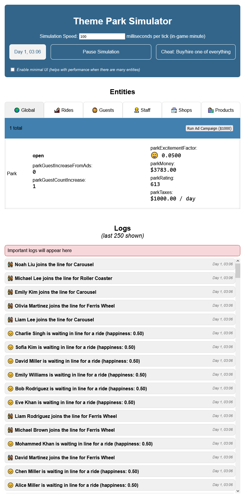

# Theme Park Simulator

This is a small experiment of a theme park simulator. It's part of a prototype for a bigger project. This part is only released for educational purposes. It won't be maintained nor updated.

## Technical Design

Everything inside `simulation.js` decides the theme of the simulation. Whether it be a Theme Park, a Zoo, a Museum, or a Library. The `simulation.js` file is the only file that needs to be modified to change the theme of the simulation.

Inside `simulation.js`, you'll also find an experimental attempt to sandbox some code of the simulation. We do this because we want to allow the user to write their own code to modify the simulation.
